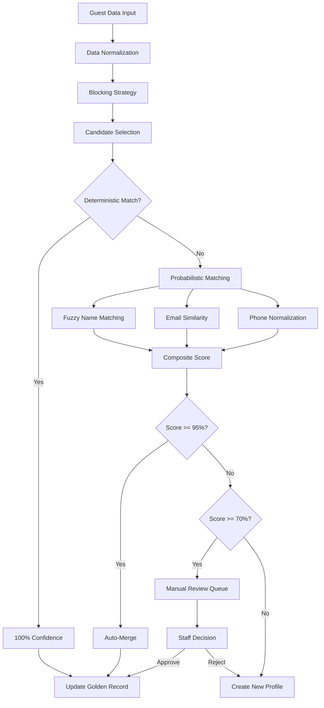

# Skill Specification: Guest Intelligence Platform

> **Skills Covered**: SKILL-047, SKILL-048, SKILL-049, SKILL-050, SKILL-051, SKILL-072, SKILL-093, SKILL-094
> **Category**: Communication / Guest Intelligence
> **Phase**: Phase 2 - Group 2 (Guest Intelligence)
> **Priority**: P2 (Enhanced)
> **Status**: SPECIFIED
> **Last Updated**: January 2026
> **Research Source**: Research Phase 2 Group 2.txt (~7,600 lines)

---

## 📋 EXECUTIVE SUMMARY

The Guest Intelligence Platform delivers **8 intelligent guest management skills** that create a unified "relationship engine" for hospitality operations:

- **95%+ profile deduplication accuracy** through fuzzy matching algorithms
- **25-40% increase in ancillary revenue** through intelligent upselling
- **360% upsell revenue growth** (Hard Rock Hotel benchmark)
- **80% reduction in review response time** with AI-powered drafts
- **15-25% upsell conversion rate** through personalized offers

### Skills Overview

| Skill ID | Name | Category | Description |
|----------|------|----------|-------------|
| **SKILL-047** | Guest Preference Tracking | Personalization | Multi-source preference learning |
| **SKILL-048** | Duplicate Profile Merging | Identity Resolution | AI-powered deduplication |
| **SKILL-049** | VIP Guest Handling | Guest Experience | RFM scoring + special protocols |
| **SKILL-050** | Upsell Management | Revenue | Personalized recommendations |
| **SKILL-051** | Pre-Arrival Questionnaire | Guest Experience | Preference capture workflows |
| **SKILL-072** | Bad Review Defense Drafting | Reputation | AI sentiment analysis + response |
| **SKILL-093** | Loyalty Tier Management | Retention | Multi-tier program engine |
| **SKILL-094** | Referral Program Management | Growth | Double-sided referral tracking |

---

## 🏗️ ARCHITECTURE ALIGNMENT NOTES

### Layer Mapping (Citadel OS 6-Layer Stack)

| Component | Citadel OS Layer | Implementation |
|-----------|------------------|----------------|
| Guest Dashboards | Layer 6: Applications | React 18 + TypeScript |
| Guest Intelligence Bundle | Layer 5: Domain Bundles | Communication bundle |
| Intelligence Skills | Layer 4: Skills Layer | SKILL.md files |
| Recommendation Engine | Layer 3: Hot Path | FastAPI + Redis |
| Identity Resolution | Layer 2: Cold Path | Python algorithms + MongoDB |
| Data Infrastructure | Layer 1: Infrastructure | MongoDB + PostgreSQL + Redis |

### Execution Path Classification

| Skill | Path | Reasoning |
|-------|------|-----------|
| SKILL-047 (Preferences) | **Hot** | Real-time preference lookup |
| SKILL-048 (Deduplication) | **Cold** | Batch fuzzy matching processing |
| SKILL-049 (VIP) | **Hybrid** | RFM scoring + real-time alerts |
| SKILL-050 (Upsell) | **Hybrid** | ML recommendations + real-time |
| SKILL-051 (Questionnaire) | **Cold** | Form workflows |
| SKILL-072 (Review Defense) | **Hybrid** | AI generation + human approval |
| SKILL-093 (Loyalty) | **Cold** | ACID transaction processing |
| SKILL-094 (Referral) | **Cold** | Fraud detection + attribution |

### MCP Server Requirements

```yaml
mcp_servers:
  # Identity Resolution
  - mcp://identity/resolve           # Fuzzy matching
  - mcp://identity/merge             # Profile merging
  - mcp://identity/golden-record     # Survivorship rules
  
  # Personalization
  - mcp://personalization/recommend  # ML recommendations
  - mcp://personalization/preferences # Preference storage
  
  # Loyalty Management
  - mcp://loyalty/tier-engine        # Tier calculations
  - mcp://loyalty/points             # Points ledger
  - mcp://treasury-write             # Financial transactions
  
  # Communication
  - mcp://communication/orchestrate  # Multi-channel delivery
  - mcp://ai/review-response         # GPT-4 response generation
  
  # Referral
  - mcp://referral/tracking          # Attribution tracking
  - mcp://fraud/detection            # Abuse prevention
```

### Infrastructure Alignment Verification

| Research Spec | Citadel OS Architecture | Status |
|---------------|------------------------|--------|
| Python 3.11+ | ✅ Aligned | Backend services |
| FastAPI 0.104+ | ✅ Aligned | High-performance APIs |
| MongoDB 7.0+ | ⚠️ Use DocumentDB | Guest profiles |
| PostgreSQL 16+ | ✅ Aligned | Loyalty transactions |
| Redis 7.2+ | ✅ Aligned | Caching layer |
| LangChain 0.1+ | ✅ Aligned | AI orchestration |
| OpenAI GPT-4 | ✅ Aligned | Response generation |
| Auth0 | ✅ Aligned | Identity management |
| AWS ECS/Fargate | ✅ Aligned | Container orchestration |

---

## 📊 SKILL SPECIFICATIONS

### SKILL-048: Duplicate Profile Merging

#### Purpose
AI-powered identity resolution using probabilistic and deterministic matching to achieve 95%+ deduplication accuracy with golden record creation and survivorship rules.

#### Technical Architecture
```python
from dataclasses import dataclass
from typing import List, Dict, Optional, Tuple
from enum import Enum
import jellyfish
import re

class MatchType(Enum):
    EXACT = "exact"
    FUZZY = "fuzzy"
    PROBABILISTIC = "probabilistic"

@dataclass
class MatchResult:
    profile_a_id: str
    profile_b_id: str
    confidence_score: float  # 0.0 to 1.0
    match_reasons: List[str]
    match_type: MatchType
    requires_review: bool

@dataclass
class GoldenRecord:
    unified_id: str
    primary_email: str
    normalized_phone: str
    canonical_name: str
    linked_profiles: List[Dict]
    data_lineage: Dict[str, str]
    merge_history: List[Dict]


class IdentityResolutionEngine:
    """
    AI-powered identity resolution achieving 95%+ accuracy.
    Uses fuzzy first-name matching with LLM-based soft matching.
    """
    
    CONFIDENCE_THRESHOLDS = {
        'auto_merge': 0.95,      # >95% = automatic merge
        'manual_review': 0.70,   # 70-95% = human review
        'separate': 0.70         # <70% = separate profiles
    }
    
    FIELD_WEIGHTS = {
        'email_exact': 0.90,
        'phone_normalized': 0.80,
        'name_fuzzy': 0.60,
        'address_normalized': 0.70
    }
    
    def __init__(self):
        self.db = MongoDB()
        self.redis = RedisClient()
    
    async def resolve_identity(
        self,
        incoming_profile: Dict
    ) -> Tuple[str, MatchResult]:
        """
        Resolve identity for incoming guest data.
        Returns unified_id and match result.
        """
        
        # Step 1: Normalize incoming data
        normalized = self._normalize_profile(incoming_profile)
        
        # Step 2: Blocking - find candidate matches
        candidates = await self._find_candidates(normalized)
        
        # Step 3: Score all candidates
        match_results = []
        for candidate in candidates:
            score = self._calculate_match_score(normalized, candidate)
            match_results.append(score)
        
        # Step 4: Select best match
        if not match_results:
            # No candidates - create new profile
            return await self._create_new_profile(normalized), None
        
        best_match = max(match_results, key=lambda x: x.confidence_score)
        
        # Step 5: Route based on confidence
        if best_match.confidence_score >= self.CONFIDENCE_THRESHOLDS['auto_merge']:
            # Auto-merge
            unified_id = await self._execute_merge(
                normalized, best_match, 'automatic'
            )
            return unified_id, best_match
        elif best_match.confidence_score >= self.CONFIDENCE_THRESHOLDS['manual_review']:
            # Queue for manual review
            await self._queue_for_review(normalized, best_match)
            return None, best_match
        else:
            # Create separate profile
            return await self._create_new_profile(normalized), best_match
    
    def _normalize_profile(self, profile: Dict) -> Dict:
        """Normalize all profile fields for matching."""
        return {
            'email': self._normalize_email(profile.get('email', '')),
            'phone': self._normalize_phone(profile.get('phone', '')),
            'first_name': self._normalize_name(profile.get('first_name', '')),
            'last_name': self._normalize_name(profile.get('last_name', '')),
            'address': self._normalize_address(profile.get('address', {})),
            'source_system': profile.get('source_system'),
            'source_id': profile.get('source_id')
        }
    
    def _normalize_email(self, email: str) -> str:
        """Normalize email: lowercase, strip domains variations."""
        if not email:
            return ''
        email = email.lower().strip()
        # Handle Gmail dots
        local, domain = email.split('@') if '@' in email else (email, '')
        if domain == 'gmail.com':
            local = local.replace('.', '')
        return f"{local}@{domain}"
    
    def _normalize_phone(self, phone: str) -> str:
        """Normalize phone: digits only with country code."""
        digits = re.sub(r'\D', '', phone)
        if len(digits) == 10:
            digits = '1' + digits  # Add US country code
        return f"+{digits}" if digits else ''
    
    def _calculate_match_score(
        self,
        profile_a: Dict,
        profile_b: Dict
    ) -> MatchResult:
        """Calculate composite match score."""
        
        scores = {}
        match_reasons = []
        
        # Email exact match
        if profile_a['email'] and profile_a['email'] == profile_b['email']:
            scores['email_exact'] = 1.0
            match_reasons.append('email_exact')
        
        # Phone normalized match
        if profile_a['phone'] and profile_a['phone'] == profile_b['phone']:
            scores['phone_normalized'] = 1.0
            match_reasons.append('phone_normalized')
        
        # Fuzzy name matching using Jaro-Winkler
        name_a = f"{profile_a['first_name']} {profile_a['last_name']}"
        name_b = f"{profile_b['first_name']} {profile_b['last_name']}"
        name_similarity = jellyfish.jaro_winkler_similarity(name_a, name_b)
        if name_similarity > 0.85:
            scores['name_fuzzy'] = name_similarity
            match_reasons.append('name_fuzzy')
        
        # Calculate weighted composite score
        if not scores:
            return MatchResult(
                profile_a_id=profile_a['source_id'],
                profile_b_id=profile_b.get('guest_id'),
                confidence_score=0.0,
                match_reasons=[],
                match_type=MatchType.EXACT,
                requires_review=False
            )
        
        total_weight = sum(self.FIELD_WEIGHTS[k] for k in scores.keys())
        weighted_sum = sum(
            scores[k] * self.FIELD_WEIGHTS[k] 
            for k in scores.keys()
        )
        composite_score = min(weighted_sum / total_weight, 1.0)
        
        return MatchResult(
            profile_a_id=profile_a['source_id'],
            profile_b_id=profile_b.get('guest_id'),
            confidence_score=composite_score,
            match_reasons=match_reasons,
            match_type=MatchType.FUZZY if 'name_fuzzy' in match_reasons else MatchType.EXACT,
            requires_review=0.70 <= composite_score < 0.95
        )
```

#### Identity Resolution Workflow


#### Golden Record Survivorship Rules
| Field | Priority 1 | Priority 2 | Priority 3 | Fallback |
|-------|-----------|-----------|-----------|----------|
| Email | PMS | Direct Booking | OTA | Most Recent |
| Phone | PMS | Direct Booking | OTA | Most Recent |
| Name | PMS | Direct Booking | OTA | Most Complete |
| Address | PMS | Direct Booking | OTA | Most Recent |
| Preferences | Explicit | Implicit (Behavior) | Default | None |

---

### SKILL-050: Upsell Management

#### Purpose
AI-driven personalized upsell recommendations with timing optimization, achieving 15-25% conversion rates and 360% revenue growth potential.

#### Technical Architecture
```python
from dataclasses import dataclass
from typing import List, Dict, Optional
from datetime import datetime, timedelta
from decimal import Decimal
import numpy as np
from sklearn.neighbors import NearestNeighbors

@dataclass
class UpsellOffer:
    offer_id: str
    guest_id: str
    booking_id: str
    offer_type: str  # room_upgrade, spa, dining, experience, parking
    title: str
    description: str
    original_price: Decimal
    offer_price: Decimal
    discount_percentage: float
    available_inventory: int
    personalization_score: float
    optimal_send_time: datetime
    expiry_time: datetime
    channel: str  # email, sms, app, front_desk
    status: str

@dataclass
class GuestSegment:
    segment_id: str
    name: str
    booking_frequency: float
    average_spend: Decimal
    preferred_amenities: List[str]
    response_rate: float


class PersonalizedUpsellEngine:
    """
    AI-powered upsell recommendation engine.
    Achieves 15-25% conversion rate through personalization.
    """
    
    TIMING_WINDOWS = {
        'high_excitement': (7, 21),    # 7-21 days pre-arrival
        'convenience': (1, 3),         # 24-72 hours pre-arrival
        'in_stay': (0, 0)              # During stay
    }
    
    OFFER_CATEGORIES = {
        'family': ['kids_activities', 'extra_bed', 'family_dining', 'pool_access'],
        'business': ['early_checkin', 'late_checkout', 'parking', 'workspace'],
        'leisure': ['spa', 'experiences', 'dining', 'tours'],
        'vip': ['suite_upgrade', 'premium_spa', 'private_dining', 'concierge']
    }
    
    def __init__(self):
        self.db = MongoDB()
        self.redis = RedisClient()
        self.model = self._load_recommendation_model()
    
    async def generate_recommendations(
        self,
        guest_id: str,
        booking_id: str,
        max_offers: int = 5
    ) -> List[UpsellOffer]:
        """Generate personalized upsell offers for guest."""
        
        # Get guest profile and booking details
        guest = await self._get_guest_profile(guest_id)
        booking = await self._get_booking(booking_id)
        
        # Get available inventory
        inventory = await self._get_available_inventory(
            booking['property_id'],
            booking['check_in_date'],
            booking['check_out_date']
        )
        
        # Determine guest segment
        segment = self._classify_guest_segment(guest)
        
        # Generate candidate offers
        candidates = self._generate_candidate_offers(
            guest, booking, inventory, segment
        )
        
        # Score and rank offers
        scored_offers = self._score_offers(candidates, guest, segment)
        
        # Apply business rules (rate limiting, inventory protection)
        filtered_offers = self._apply_business_rules(scored_offers, guest)
        
        # Calculate optimal timing
        timed_offers = self._calculate_optimal_timing(
            filtered_offers, booking, guest
        )
        
        return timed_offers[:max_offers]
    
    def _classify_guest_segment(self, guest: Dict) -> GuestSegment:
        """Classify guest into behavioral segment."""
        
        booking_count = len(guest.get('booking_history', []))
        total_spend = sum(
            b.get('total_amount', 0) 
            for b in guest.get('booking_history', [])
        )
        avg_spend = total_spend / max(booking_count, 1)
        
        # Determine segment based on patterns
        if guest.get('vip_status', {}).get('is_vip'):
            return GuestSegment(
                segment_id='vip',
                name='VIP Guest',
                booking_frequency=booking_count / 12,
                average_spend=Decimal(str(avg_spend)),
                preferred_amenities=self.OFFER_CATEGORIES['vip'],
                response_rate=0.35
            )
        elif guest.get('preferences', {}).get('travel_type') == 'business':
            return GuestSegment(
                segment_id='business',
                name='Business Traveler',
                booking_frequency=booking_count / 12,
                average_spend=Decimal(str(avg_spend)),
                preferred_amenities=self.OFFER_CATEGORIES['business'],
                response_rate=0.25
            )
        elif guest.get('preferences', {}).get('guest_count', 1) > 2:
            return GuestSegment(
                segment_id='family',
                name='Family Traveler',
                booking_frequency=booking_count / 12,
                average_spend=Decimal(str(avg_spend)),
                preferred_amenities=self.OFFER_CATEGORIES['family'],
                response_rate=0.20
            )
        else:
            return GuestSegment(
                segment_id='leisure',
                name='Leisure Traveler',
                booking_frequency=booking_count / 12,
                average_spend=Decimal(str(avg_spend)),
                preferred_amenities=self.OFFER_CATEGORIES['leisure'],
                response_rate=0.18
            )
    
    def _score_offers(
        self,
        candidates: List[Dict],
        guest: Dict,
        segment: GuestSegment
    ) -> List[UpsellOffer]:
        """Score offers using collaborative filtering + content-based."""
        
        scored = []
        for offer in candidates:
            # Base relevance score from collaborative filtering
            cf_score = self._collaborative_filtering_score(
                guest['guest_id'], offer['offer_type']
            )
            
            # Content-based score from preferences
            cb_score = self._content_based_score(
                guest.get('preferences', {}), offer
            )
            
            # Price sensitivity adjustment
            price_score = self._price_sensitivity_score(
                offer['offer_price'], segment.average_spend
            )
            
            # Segment preference boost
            segment_boost = 1.2 if offer['offer_type'] in segment.preferred_amenities else 1.0
            
            # Composite score
            final_score = (
                cf_score * 0.4 +
                cb_score * 0.3 +
                price_score * 0.2
            ) * segment_boost
            
            offer['personalization_score'] = final_score
            scored.append(offer)
        
        return sorted(scored, key=lambda x: x['personalization_score'], reverse=True)
    
    def _calculate_optimal_timing(
        self,
        offers: List[Dict],
        booking: Dict,
        guest: Dict
    ) -> List[UpsellOffer]:
        """Calculate optimal send time for each offer."""
        
        check_in = datetime.fromisoformat(booking['check_in_date'])
        days_until = (check_in - datetime.utcnow()).days
        
        # Determine timing window
        if days_until >= 7:
            window = 'high_excitement'
            # Best time: 10 AM local time
            optimal_hour = 10
        elif days_until >= 1:
            window = 'convenience'
            optimal_hour = 9
        else:
            window = 'in_stay'
            optimal_hour = 14  # Afternoon during stay
        
        timed_offers = []
        for i, offer in enumerate(offers):
            # Stagger offers to avoid overwhelming guest
            send_offset = i * 4  # 4 hours between offers
            
            optimal_time = datetime.utcnow().replace(
                hour=optimal_hour
            ) + timedelta(hours=send_offset)
            
            offer['optimal_send_time'] = optimal_time
            offer['expiry_time'] = check_in - timedelta(hours=2)
            
            timed_offers.append(UpsellOffer(**offer))
        
        return timed_offers
```

#### Upsell Timing Matrix
| Timing Window | Days Before | Best Offers | Channel | Conversion Rate |
|---------------|-------------|-------------|---------|-----------------|
| High Excitement | 7-21 days | Room upgrades, Experiences | Email | 18-22% |
| Convenience | 1-3 days | Early check-in, Parking | SMS, App | 22-28% |
| Day of Arrival | 0 days | Last-minute upgrades | Front Desk | 30-35% |
| During Stay | Stay period | Spa, Dining, Add-ons | App, QR | 15-20% |

---

### SKILL-093: Loyalty Tier Management

#### Purpose
Multi-tier loyalty program engine with automated tier qualification, points management, and benefit delivery inspired by Marriott Bonvoy.

#### Technical Architecture
```python
from dataclasses import dataclass
from typing import List, Dict, Optional
from datetime import datetime, date
from decimal import Decimal
from enum import Enum

class LoyaltyTier(Enum):
    MEMBER = "member"
    SILVER = "silver"
    GOLD = "gold"
    PLATINUM = "platinum"

@dataclass
class TierConfiguration:
    tier: LoyaltyTier
    qualifying_nights: int
    qualifying_spend: Decimal
    points_multiplier: float
    benefits: List[str]
    upgrade_benefits: List[str]

@dataclass
class LoyaltyAccount:
    account_id: str
    guest_id: str
    member_number: str
    current_tier: LoyaltyTier
    points_balance: int
    lifetime_points: int
    qualifying_nights: int
    qualifying_spend: Decimal
    tier_qualification_date: date
    tier_expiry_date: date
    status: str


class LoyaltyTierEngine:
    """
    Multi-tier loyalty program management.
    Inspired by Marriott Bonvoy's 5-tier structure.
    """
    
    TIER_CONFIGURATIONS = {
        LoyaltyTier.MEMBER: TierConfiguration(
            tier=LoyaltyTier.MEMBER,
            qualifying_nights=0,
            qualifying_spend=Decimal('0'),
            points_multiplier=1.0,
            benefits=['free_wifi', 'member_rates'],
            upgrade_benefits=['welcome_package']
        ),
        LoyaltyTier.SILVER: TierConfiguration(
            tier=LoyaltyTier.SILVER,
            qualifying_nights=6,
            qualifying_spend=Decimal('0'),
            points_multiplier=1.2,
            benefits=['free_wifi', 'member_rates', 'late_checkout', 'priority_support'],
            upgrade_benefits=['room_upgrade_certificate']
        ),
        LoyaltyTier.GOLD: TierConfiguration(
            tier=LoyaltyTier.GOLD,
            qualifying_nights=21,
            qualifying_spend=Decimal('0'),
            points_multiplier=1.5,
            benefits=['free_wifi', 'member_rates', 'late_checkout', 'priority_support',
                      'room_upgrades', 'welcome_amenities', 'enhanced_wifi'],
            upgrade_benefits=['spa_credit', 'lounge_access']
        ),
        LoyaltyTier.PLATINUM: TierConfiguration(
            tier=LoyaltyTier.PLATINUM,
            qualifying_nights=50,
            qualifying_spend=Decimal('10000'),
            points_multiplier=2.0,
            benefits=['free_wifi', 'member_rates', 'guaranteed_late_checkout',
                      'priority_support', 'suite_upgrades', 'welcome_amenities',
                      'enhanced_wifi', 'dedicated_concierge', 'breakfast_included'],
            upgrade_benefits=['annual_free_night', 'ambassador_service']
        )
    }
    
    POINTS_PER_DOLLAR = 10
    
    def __init__(self):
        self.db = PostgreSQL()  # ACID compliance for financial
        self.redis = RedisClient()
    
    async def calculate_tier_status(
        self,
        guest_id: str
    ) -> Dict:
        """Calculate current tier and progress to next."""
        
        account = await self._get_loyalty_account(guest_id)
        
        # Calculate qualifying activity for current year
        activity = await self._get_qualifying_activity(
            account['account_id'],
            datetime(datetime.utcnow().year, 1, 1)
        )
        
        # Determine current tier
        current_tier = self._determine_tier(activity)
        
        # Calculate progress to next tier
        next_tier = self._get_next_tier(current_tier)
        progress = self._calculate_progress(activity, next_tier)
        
        return {
            'current_tier': current_tier.value,
            'qualifying_nights': activity['qualifying_nights'],
            'qualifying_spend': float(activity['qualifying_spend']),
            'points_balance': account['points_balance'],
            'lifetime_points': account['lifetime_points'],
            'next_tier': next_tier.value if next_tier else None,
            'progress': progress,
            'tier_expiry_date': account['tier_expiry_date'].isoformat()
        }
    
    def _determine_tier(self, activity: Dict) -> LoyaltyTier:
        """Determine tier based on qualifying activity."""
        
        nights = activity['qualifying_nights']
        spend = activity['qualifying_spend']
        
        if nights >= 50 and spend >= Decimal('10000'):
            return LoyaltyTier.PLATINUM
        elif nights >= 21:
            return LoyaltyTier.GOLD
        elif nights >= 6:
            return LoyaltyTier.SILVER
        else:
            return LoyaltyTier.MEMBER
    
    async def process_stay_completion(
        self,
        guest_id: str,
        booking_id: str,
        stay_details: Dict
    ) -> Dict:
        """Process completed stay for points and tier progress."""
        
        account = await self._get_loyalty_account(guest_id)
        tier_config = self.TIER_CONFIGURATIONS[
            LoyaltyTier(account['current_tier'])
        ]
        
        # Calculate points earned
        base_spend = Decimal(str(stay_details['total_spend']))
        base_points = int(base_spend * self.POINTS_PER_DOLLAR)
        tier_bonus = tier_config.points_multiplier
        total_points = int(base_points * tier_bonus)
        
        # Calculate bonus points
        bonus_points = self._calculate_bonus_points(stay_details)
        total_points += bonus_points
        
        # Record transaction
        transaction_id = await self._record_points_transaction(
            account_id=account['account_id'],
            transaction_type='earn',
            points_amount=total_points,
            booking_reference=booking_id,
            description=f"Stay completion - {stay_details['nights']} nights"
        )
        
        # Update qualifying activity
        await self._update_qualifying_activity(
            account['account_id'],
            nights=stay_details['nights'],
            spend=base_spend
        )
        
        # Check for tier upgrade
        tier_change = await self._check_tier_upgrade(guest_id)
        
        return {
            'points_earned': total_points,
            'new_balance': account['points_balance'] + total_points,
            'transaction_id': transaction_id,
            'tier_change': tier_change
        }
    
    async def redeem_points(
        self,
        guest_id: str,
        redemption_type: str,
        points_required: int,
        redemption_details: Dict
    ) -> Dict:
        """Process points redemption."""
        
        account = await self._get_loyalty_account(guest_id)
        
        # Validate sufficient balance
        if account['points_balance'] < points_required:
            raise ValueError(f"Insufficient points. Balance: {account['points_balance']}")
        
        # Record redemption transaction
        transaction_id = await self._record_points_transaction(
            account_id=account['account_id'],
            transaction_type='redeem',
            points_amount=-points_required,
            description=f"Redemption: {redemption_type}"
        )
        
        # Update liability tracking
        await self._update_liability(
            points_amount=-points_required,
            redemption_value=redemption_details.get('value', 0)
        )
        
        return {
            'transaction_id': transaction_id,
            'points_redeemed': points_required,
            'new_balance': account['points_balance'] - points_required,
            'redemption_type': redemption_type
        }
```

#### Tier Structure
| Tier | Nights Required | Spend Required | Points Multiplier | Key Benefits |
|------|-----------------|----------------|-------------------|--------------|
| Member | 0 | $0 | 1.0x | Free WiFi, Member Rates |
| Silver | 6 | $0 | 1.2x | Late Checkout, Priority Support |
| Gold | 21 | $0 | 1.5x | Room Upgrades, Welcome Amenities |
| Platinum | 50 | $10,000 | 2.0x | Suite Upgrades, Dedicated Concierge |

---

### SKILL-072: Bad Review Defense Drafting

#### Purpose
AI-powered sentiment analysis and response generation achieving 75% reduction in response drafting time while maintaining brand voice consistency.

#### Technical Architecture
```python
from dataclasses import dataclass
from typing import List, Dict, Optional
from enum import Enum
from langchain_openai import ChatOpenAI
from langchain.prompts import ChatPromptTemplate

class SentimentCategory(Enum):
    VERY_POSITIVE = "very_positive"  # > 0.7
    POSITIVE = "positive"            # 0.3 to 0.7
    NEUTRAL = "neutral"              # -0.3 to 0.3
    NEGATIVE = "negative"            # -0.7 to -0.3
    VERY_NEGATIVE = "very_negative"  # < -0.7

@dataclass
class ReviewAnalysis:
    review_id: str
    platform: str
    rating: int
    text: str
    sentiment_score: float
    sentiment_category: SentimentCategory
    topics: List[str]
    urgency: str
    escalation_required: bool
    escalation_reasons: List[str]

@dataclass
class GeneratedResponse:
    response_id: str
    review_id: str
    response_text: str
    confidence_score: float
    requires_human_review: bool
    suggested_actions: List[str]
    tone_verified: bool


class ReviewResponseService:
    """
    AI-powered review response generation.
    Achieves 75% reduction in response drafting time.
    """
    
    ESCALATION_KEYWORDS = {
        'immediate': ['lawsuit', 'discrimination', 'injury', 'theft', 'assault'],
        'management': ['manager', 'refund', 'compensation', 'unacceptable', 'disgusting']
    }
    
    RESPONSE_STRATEGIES = {
        SentimentCategory.VERY_POSITIVE: {
            'structure': ['acknowledge', 'thank', 'invite_return'],
            'tone': 'grateful_professional'
        },
        SentimentCategory.POSITIVE: {
            'structure': ['acknowledge', 'thank', 'highlight', 'invite_return'],
            'tone': 'warm_professional'
        },
        SentimentCategory.NEUTRAL: {
            'structure': ['acknowledge', 'thank', 'highlight_positives', 'address_concerns'],
            'tone': 'friendly_professional'
        },
        SentimentCategory.NEGATIVE: {
            'structure': ['acknowledge', 'apologize', 'explain', 'resolve', 'invite_offline'],
            'tone': 'empathetic_solution_focused'
        },
        SentimentCategory.VERY_NEGATIVE: {
            'structure': ['acknowledge', 'apologize', 'take_responsibility', 
                         'specific_resolution', 'invite_offline', 'executive_contact'],
            'tone': 'sincere_urgent_resolution'
        }
    }
    
    RESPONSE_TIMING = {
        SentimentCategory.VERY_NEGATIVE: 'within_2_hours',
        SentimentCategory.NEGATIVE: 'within_4_hours',
        SentimentCategory.NEUTRAL: 'within_24_hours',
        SentimentCategory.POSITIVE: 'within_48_hours',
        SentimentCategory.VERY_POSITIVE: 'within_48_hours'
    }
    
    def __init__(self):
        self.llm = ChatOpenAI(
            model="gpt-4",
            temperature=0.3,  # Lower for consistency
            max_tokens=300
        )
        self.db = MongoDB()
    
    async def analyze_and_respond(
        self,
        review_id: str,
        platform: str,
        rating: int,
        review_text: str,
        property_name: str,
        guest_name: Optional[str] = None
    ) -> GeneratedResponse:
        """Analyze review and generate appropriate response."""
        
        # Step 1: Analyze sentiment
        analysis = await self._analyze_sentiment(
            review_id, platform, rating, review_text
        )
        
        # Step 2: Check escalation
        if analysis.escalation_required:
            await self._trigger_escalation(analysis)
        
        # Step 3: Generate response
        strategy = self.RESPONSE_STRATEGIES[analysis.sentiment_category]
        
        response = await self._generate_response(
            review_text=review_text,
            guest_name=guest_name,
            property_name=property_name,
            strategy=strategy,
            topics=analysis.topics,
            rating=rating
        )
        
        # Step 4: Validate brand voice
        validation = await self._validate_brand_voice(response, strategy['tone'])
        
        return GeneratedResponse(
            response_id=str(uuid4()),
            review_id=review_id,
            response_text=response,
            confidence_score=validation['confidence'],
            requires_human_review=analysis.sentiment_category in [
                SentimentCategory.NEGATIVE, SentimentCategory.VERY_NEGATIVE
            ] or validation['confidence'] < 0.85,
            suggested_actions=self._generate_action_items(analysis),
            tone_verified=validation['tone_match']
        )
    
    async def _analyze_sentiment(
        self,
        review_id: str,
        platform: str,
        rating: int,
        text: str
    ) -> ReviewAnalysis:
        """Analyze review sentiment and extract topics."""
        
        # Use GPT-4 for sentiment analysis
        sentiment_prompt = ChatPromptTemplate.from_messages([
            ("system", "You are a sentiment analysis expert for hospitality reviews."),
            ("user", """Analyze this hotel review:
            Rating: {rating}/5
            Review: {text}
            
            Provide:
            1. Sentiment score (-1.0 to 1.0)
            2. Key topics mentioned
            3. Urgency level (low/medium/high/critical)
            
            Format as JSON.""")
        ])
        
        response = await self.llm.ainvoke(
            sentiment_prompt.format(rating=rating, text=text)
        )
        
        analysis = self._parse_sentiment_response(response.content)
        
        # Determine sentiment category
        score = analysis['sentiment_score']
        if score > 0.7:
            category = SentimentCategory.VERY_POSITIVE
        elif score > 0.3:
            category = SentimentCategory.POSITIVE
        elif score > -0.3:
            category = SentimentCategory.NEUTRAL
        elif score > -0.7:
            category = SentimentCategory.NEGATIVE
        else:
            category = SentimentCategory.VERY_NEGATIVE
        
        # Check escalation triggers
        escalation_required, escalation_reasons = self._check_escalation(
            text, rating, category
        )
        
        return ReviewAnalysis(
            review_id=review_id,
            platform=platform,
            rating=rating,
            text=text,
            sentiment_score=score,
            sentiment_category=category,
            topics=analysis['topics'],
            urgency=analysis['urgency'],
            escalation_required=escalation_required,
            escalation_reasons=escalation_reasons
        )
    
    async def _generate_response(
        self,
        review_text: str,
        guest_name: Optional[str],
        property_name: str,
        strategy: Dict,
        topics: List[str],
        rating: int
    ) -> str:
        """Generate personalized response using GPT-4."""
        
        response_prompt = ChatPromptTemplate.from_messages([
            ("system", """You are a professional hotel guest relations manager.
            Generate review responses that are:
            - Personalized with guest name and specific details
            - Maintain consistent brand voice
            - Under 150 words
            - Never admit fault without management approval
            - Always offer offline resolution for complaints"""),
            ("user", """Generate a response for this review:
            
            Review: {review_text}
            Guest Name: {guest_name}
            Property: {property_name}
            Rating: {rating}/5
            
            Response Structure: {structure}
            Tone: {tone}
            Topics to Address: {topics}
            
            Generate the response:""")
        ])
        
        response = await self.llm.ainvoke(
            response_prompt.format(
                review_text=review_text,
                guest_name=guest_name or "valued guest",
                property_name=property_name,
                rating=rating,
                structure=", ".join(strategy['structure']),
                tone=strategy['tone'],
                topics=", ".join(topics)
            )
        )
        
        return response.content.strip()
```

#### Escalation Matrix
| Trigger | Escalation Level | Response Time | Notification |
|---------|------------------|---------------|--------------|
| 1-star rating | High | <4 hours | Manager |
| Keywords: lawsuit, injury | Critical | <2 hours | GM + Legal |
| VIP guest negative | High | <2 hours | GM |
| Sentiment < -0.7 | High | <4 hours | Manager |
| Repeated complaints | Medium | <24 hours | Operations |

---

### SKILL-047: Guest Preference Tracking

#### Purpose
Multi-source preference learning from explicit and implicit signals for hyper-personalization.

#### Technical Architecture
```python
@dataclass
class GuestPreference:
    preference_id: str
    guest_id: str
    category: str
    preference_key: str
    preference_value: str
    source: str  # explicit, implicit, inferred
    confidence: float
    last_updated: datetime
    occurrence_count: int

class PreferenceTrackingService:
    """
    Multi-source preference learning and storage.
    Combines explicit declarations with behavioral signals.
    """
    
    PREFERENCE_CATEGORIES = {
        'room': ['room_type', 'floor_preference', 'bed_type', 'view_preference'],
        'amenities': ['spa', 'gym', 'pool', 'business_center', 'lounge'],
        'dietary': ['vegetarian', 'vegan', 'halal', 'kosher', 'allergies'],
        'communication': ['preferred_channel', 'language', 'contact_time'],
        'service': ['turndown', 'housekeeping_frequency', 'wake_up_call'],
        'special_requests': ['quiet_room', 'near_elevator', 'pet_friendly']
    }
    
    async def track_explicit_preference(
        self,
        guest_id: str,
        category: str,
        preference_key: str,
        preference_value: str
    ) -> GuestPreference:
        """Record explicitly stated preference."""
        
        preference = GuestPreference(
            preference_id=str(uuid4()),
            guest_id=guest_id,
            category=category,
            preference_key=preference_key,
            preference_value=preference_value,
            source='explicit',
            confidence=1.0,
            last_updated=datetime.utcnow(),
            occurrence_count=1
        )
        
        await self._upsert_preference(preference)
        return preference
    
    async def track_implicit_preference(
        self,
        guest_id: str,
        action: str,
        context: Dict
    ) -> Optional[GuestPreference]:
        """Infer preference from behavioral signal."""
        
        # Map actions to preferences
        inference_rules = {
            'booked_spa': ('amenities', 'spa', 'preferred'),
            'requested_late_checkout': ('service', 'late_checkout', 'preferred'),
            'ordered_vegetarian': ('dietary', 'vegetarian', 'likely'),
            'used_gym': ('amenities', 'gym', 'active_user'),
            'upgraded_to_suite': ('room', 'room_type', 'suite_preference')
        }
        
        if action not in inference_rules:
            return None
        
        category, key, value = inference_rules[action]
        
        # Check if preference already exists
        existing = await self._get_preference(guest_id, category, key)
        
        if existing:
            # Increase confidence with repeated behavior
            new_confidence = min(existing.confidence + 0.1, 0.95)
            existing.confidence = new_confidence
            existing.occurrence_count += 1
            existing.last_updated = datetime.utcnow()
            await self._update_preference(existing)
            return existing
        else:
            preference = GuestPreference(
                preference_id=str(uuid4()),
                guest_id=guest_id,
                category=category,
                preference_key=key,
                preference_value=value,
                source='implicit',
                confidence=0.6,  # Initial implicit confidence
                last_updated=datetime.utcnow(),
                occurrence_count=1
            )
            await self._upsert_preference(preference)
            return preference
```

---

### SKILL-049: VIP Guest Handling

#### Purpose
RFM scoring and special handling protocols for high-value guests.

#### Technical Architecture
```python
@dataclass
class VIPProfile:
    guest_id: str
    vip_tier: str  # standard, gold, platinum, ambassador
    rfm_score: int  # 0-100
    lifetime_value: Decimal
    social_influence_score: int
    special_handling_notes: str
    assigned_concierge: Optional[str]
    protocols: List[str]

class VIPManagementService:
    """
    VIP identification using RFM + social influence scoring.
    """
    
    RFM_WEIGHTS = {
        'recency': 0.25,      # Days since last stay
        'frequency': 0.35,    # Stays per year
        'monetary': 0.40      # Average spend per stay
    }
    
    VIP_THRESHOLDS = {
        'ambassador': {'rfm': 90, 'ltv': 50000},
        'platinum': {'rfm': 75, 'ltv': 25000},
        'gold': {'rfm': 60, 'ltv': 10000},
        'standard': {'rfm': 0, 'ltv': 0}
    }
    
    async def calculate_vip_status(self, guest_id: str) -> VIPProfile:
        """Calculate VIP status using RFM scoring."""
        
        # Get guest activity data
        activity = await self._get_guest_activity(guest_id)
        
        # Calculate RFM components
        recency_score = self._score_recency(activity['days_since_last_stay'])
        frequency_score = self._score_frequency(activity['stays_per_year'])
        monetary_score = self._score_monetary(activity['avg_spend'])
        
        # Composite RFM score
        rfm_score = int(
            recency_score * self.RFM_WEIGHTS['recency'] +
            frequency_score * self.RFM_WEIGHTS['frequency'] +
            monetary_score * self.RFM_WEIGHTS['monetary']
        )
        
        # Determine VIP tier
        ltv = activity['lifetime_value']
        vip_tier = 'standard'
        for tier, thresholds in self.VIP_THRESHOLDS.items():
            if rfm_score >= thresholds['rfm'] and ltv >= thresholds['ltv']:
                vip_tier = tier
                break
        
        # Get social influence (followers, reviews written)
        social_score = await self._calculate_social_influence(guest_id)
        
        # Determine protocols
        protocols = self._determine_protocols(vip_tier, rfm_score, social_score)
        
        return VIPProfile(
            guest_id=guest_id,
            vip_tier=vip_tier,
            rfm_score=rfm_score,
            lifetime_value=Decimal(str(ltv)),
            social_influence_score=social_score,
            special_handling_notes=await self._get_handling_notes(guest_id),
            assigned_concierge=await self._get_assigned_concierge(vip_tier),
            protocols=protocols
        )
```

#### VIP Protocol Matrix
| VIP Tier | RFM Score | LTV | Protocols |
|----------|-----------|-----|-----------|
| Ambassador | 90+ | $50K+ | Dedicated concierge, Pre-arrival call, Suite upgrade, Executive contact |
| Platinum | 75-89 | $25K+ | Priority check-in, Room upgrade, Welcome amenity, GM greeting |
| Gold | 60-74 | $10K+ | Express check-in, Upgrade when available, Welcome note |
| Standard | <60 | <$10K | Standard service |

---

### SKILL-051: Pre-Arrival Questionnaire

#### Purpose
Preference capture workflows to gather guest requirements before arrival.

#### Technical Architecture
```python
@dataclass
class QuestionnaireResponse:
    response_id: str
    guest_id: str
    booking_id: str
    questionnaire_type: str
    responses: Dict[str, any]
    completed_at: datetime
    preferences_extracted: List[Dict]

class PreArrivalQuestionnaireService:
    """
    Automated pre-arrival questionnaire distribution and processing.
    """
    
    QUESTIONNAIRE_TEMPLATES = {
        'standard': [
            {'q': 'What time do you expect to arrive?', 'type': 'time', 'key': 'arrival_time'},
            {'q': 'Do you have any special requests?', 'type': 'text', 'key': 'special_requests'},
            {'q': 'Any dietary restrictions?', 'type': 'multi_select', 
             'options': ['vegetarian', 'vegan', 'halal', 'kosher', 'gluten_free', 'none'],
             'key': 'dietary'},
            {'q': 'Room preferences?', 'type': 'multi_select',
             'options': ['high_floor', 'quiet', 'near_elevator', 'view'],
             'key': 'room_preferences'}
        ],
        'family': [
            {'q': 'Ages of children?', 'type': 'array', 'key': 'children_ages'},
            {'q': 'Need a crib or rollaway bed?', 'type': 'boolean', 'key': 'extra_bedding'},
            {'q': 'Interested in kids activities?', 'type': 'boolean', 'key': 'kids_activities'}
        ],
        'business': [
            {'q': 'Need early check-in?', 'type': 'boolean', 'key': 'early_checkin'},
            {'q': 'Require workspace/meeting room?', 'type': 'boolean', 'key': 'workspace'},
            {'q': 'Express checkout preferred?', 'type': 'boolean', 'key': 'express_checkout'}
        ]
    }
    
    async def send_questionnaire(
        self,
        guest_id: str,
        booking_id: str,
        questionnaire_type: str = 'standard'
    ) -> str:
        """Send pre-arrival questionnaire to guest."""
        
        guest = await self._get_guest_profile(guest_id)
        booking = await self._get_booking(booking_id)
        
        # Select template based on booking type
        if booking.get('guest_count', 1) > 2:
            questionnaire_type = 'family'
        elif booking.get('rate_code') == 'BUSINESS':
            questionnaire_type = 'business'
        
        template = self.QUESTIONNAIRE_TEMPLATES[questionnaire_type]
        
        # Generate questionnaire link
        link = await self._generate_questionnaire_link(
            guest_id, booking_id, template
        )
        
        # Send via preferred channel
        channel = guest.get('preferences', {}).get('preferred_channel', 'email')
        await self._send_questionnaire(guest, link, channel)
        
        return link
```

---

### SKILL-094: Referral Program Management

#### Purpose
Double-sided referral tracking with fraud prevention and reward fulfillment.

#### Technical Architecture
```python
@dataclass
class ReferralCode:
    code: str
    referrer_id: str
    created_at: datetime
    expires_at: datetime
    max_uses: int
    current_uses: int
    status: str

@dataclass
class ReferralTransaction:
    transaction_id: str
    referral_code: str
    referrer_id: str
    referred_id: str
    qualifying_booking_id: str
    referrer_reward: Decimal
    referred_reward: Decimal
    status: str
    fraud_score: float

class ReferralProgramService:
    """
    Double-sided referral program with fraud prevention.
    Inspired by Airbnb's referral model.
    """
    
    REWARD_STRUCTURE = {
        'referrer': {
            'points': 1000,
            'credit': Decimal('25.00'),
            'max_annual': Decimal('5000.00')
        },
        'referred': {
            'discount_percentage': 10,
            'max_discount': Decimal('50.00')
        }
    }
    
    FRAUD_INDICATORS = {
        'same_ip': 0.3,
        'same_payment_method': 0.4,
        'same_address': 0.5,
        'rapid_signups': 0.2,
        'disposable_email': 0.3
    }
    
    async def create_referral_code(
        self,
        referrer_id: str
    ) -> ReferralCode:
        """Generate unique referral code for guest."""
        
        # Check annual limit
        annual_rewards = await self._get_annual_rewards(referrer_id)
        if annual_rewards >= self.REWARD_STRUCTURE['referrer']['max_annual']:
            raise ValueError("Annual referral reward limit reached")
        
        code = ReferralCode(
            code=self._generate_unique_code(),
            referrer_id=referrer_id,
            created_at=datetime.utcnow(),
            expires_at=datetime.utcnow() + timedelta(days=365),
            max_uses=50,
            current_uses=0,
            status='active'
        )
        
        await self._save_referral_code(code)
        return code
    
    async def process_referral_booking(
        self,
        referral_code: str,
        referred_id: str,
        booking_id: str
    ) -> ReferralTransaction:
        """Process referral when referred guest completes qualifying booking."""
        
        # Validate code
        code = await self._get_referral_code(referral_code)
        if not code or code.status != 'active':
            raise ValueError("Invalid or expired referral code")
        
        # Fraud detection
        fraud_score = await self._calculate_fraud_score(
            code.referrer_id, referred_id, booking_id
        )
        
        if fraud_score > 0.7:
            await self._flag_for_review(code, referred_id, fraud_score)
            raise ValueError("Referral flagged for review")
        
        # Verify qualifying booking
        booking = await self._get_booking(booking_id)
        if not self._is_qualifying_booking(booking):
            raise ValueError("Booking does not qualify for referral reward")
        
        # Calculate rewards
        referrer_reward = self.REWARD_STRUCTURE['referrer']['credit']
        referred_discount = min(
            booking['total'] * Decimal('0.10'),
            self.REWARD_STRUCTURE['referred']['max_discount']
        )
        
        # Create transaction
        transaction = ReferralTransaction(
            transaction_id=str(uuid4()),
            referral_code=referral_code,
            referrer_id=code.referrer_id,
            referred_id=referred_id,
            qualifying_booking_id=booking_id,
            referrer_reward=referrer_reward,
            referred_reward=referred_discount,
            status='pending_completion',
            fraud_score=fraud_score
        )
        
        await self._save_transaction(transaction)
        
        # Apply referred discount immediately
        await self._apply_booking_discount(booking_id, referred_discount)
        
        return transaction
```

#### Referral Reward Structure
| Party | Reward Type | Amount | Limit |
|-------|-------------|--------|-------|
| Referrer | Credit | $25 | $5,000/year |
| Referrer | Points | 1,000 | Unlimited |
| Referred | Discount | 10% up to $50 | First booking |

---

## 🗄️ DATABASE SCHEMA

### MongoDB Collections (Guest Profiles)

```javascript
// Guest Profile Collection
{
  "_id": "ObjectId",
  "guest_id": "string",
  "identity_cluster_id": "string",
  "profile_data": {
    "personal_info": {
      "first_name": "string",
      "last_name": "string",
      "email": "string",
      "phone": "string"
    },
    "preferences": {
      "room_type": "string",
      "amenities": ["string"],
      "dietary": ["string"],
      "communication": {
        "preferred_channel": "string",
        "language": "string"
      }
    }
  },
  "vip_status": {
    "is_vip": "boolean",
    "vip_tier": "string",
    "rfm_score": "number",
    "lifetime_value": "Decimal128"
  },
  "data_compliance": {
    "gdpr_consent": "boolean",
    "marketing_consent": "boolean",
    "consent_date": "date"
  }
}

// Identity Cluster Collection
{
  "_id": "ObjectId",
  "cluster_id": "string",
  "golden_record": {
    "unified_id": "string",
    "primary_email": "string",
    "normalized_phone": "string",
    "canonical_name": "string",
    "confidence_score": "number"
  },
  "linked_profiles": [{
    "source_id": "string",
    "source_system": "string",
    "confidence_score": "number",
    "match_reasons": ["string"]
  }],
  "merge_history": [{
    "timestamp": "date",
    "action": "string",
    "operator": "string"
  }]
}

// Indexes
db.guest_profiles.createIndex({ "guest_id": 1 }, { unique: true });
db.guest_profiles.createIndex({ "identity_cluster_id": 1 });
db.guest_profiles.createIndex({ "profile_data.personal_info.email": 1 });
db.identity_clusters.createIndex({ "cluster_id": 1 }, { unique: true });
```

### PostgreSQL Tables (Loyalty)

```sql
-- Loyalty Accounts
CREATE TABLE loyalty_accounts (
    account_id UUID PRIMARY KEY DEFAULT gen_random_uuid(),
    guest_id VARCHAR(50) NOT NULL,
    member_number VARCHAR(100) UNIQUE NOT NULL,
    current_tier VARCHAR(20) NOT NULL DEFAULT 'member',
    points_balance INTEGER NOT NULL DEFAULT 0,
    lifetime_points INTEGER NOT NULL DEFAULT 0,
    qualifying_nights INTEGER NOT NULL DEFAULT 0,
    qualifying_spend DECIMAL(10,2) NOT NULL DEFAULT 0.00,
    tier_expiry_date DATE,
    created_at TIMESTAMPTZ DEFAULT CURRENT_TIMESTAMP
);

-- Points Transactions (Partitioned)
CREATE TABLE points_transactions (
    transaction_id UUID DEFAULT gen_random_uuid(),
    account_id UUID NOT NULL REFERENCES loyalty_accounts(account_id),
    transaction_type VARCHAR(20) NOT NULL,
    points_amount INTEGER NOT NULL,
    transaction_date TIMESTAMPTZ DEFAULT CURRENT_TIMESTAMP,
    description TEXT
) PARTITION BY RANGE (transaction_date);

-- Referral Codes
CREATE TABLE referral_codes (
    code VARCHAR(20) PRIMARY KEY,
    referrer_id VARCHAR(50) NOT NULL,
    created_at TIMESTAMPTZ DEFAULT CURRENT_TIMESTAMP,
    expires_at TIMESTAMPTZ NOT NULL,
    max_uses INTEGER DEFAULT 50,
    current_uses INTEGER DEFAULT 0,
    status VARCHAR(20) DEFAULT 'active'
);

-- Indexes
CREATE INDEX idx_loyalty_guest_id ON loyalty_accounts(guest_id);
CREATE INDEX idx_points_account_date ON points_transactions(account_id, transaction_date);
CREATE INDEX idx_referral_referrer ON referral_codes(referrer_id);
```

---

## 📊 PERFORMANCE REQUIREMENTS

| Skill | Response Time | Throughput | Availability |
|-------|--------------|------------|--------------|
| SKILL-047 (Preferences) | <100ms | 5000 req/min | 99.9% |
| SKILL-048 (Deduplication) | <2s | 1000 profiles/hr | 99.5% |
| SKILL-049 (VIP) | <200ms | 2000 req/min | 99.9% |
| SKILL-050 (Upsell) | <500ms | 5000 req/min | 99.5% |
| SKILL-051 (Questionnaire) | <1s | 500 req/min | 99.0% |
| SKILL-072 (Review Response) | <30s | 100 reviews/min | 99.0% |
| SKILL-093 (Loyalty) | <500ms | 1000 req/min | 99.99% |
| SKILL-094 (Referral) | <1s | 200 req/min | 99.5% |

---

## 🔐 SECURITY CONSIDERATIONS

### Data Protection
| Data Type | Encryption | Retention | Access Control |
|-----------|------------|-----------|----------------|
| Guest PII | AES-256 at rest, TLS 1.3 in transit | 7 years | RBAC + RLS |
| Preferences | AES-256 | 3 years active | RBAC |
| Loyalty Points | AES-256 | 10 years | RBAC + Audit |
| Payment Data | PCI DSS compliant | 1 year | PCI Zone |

### Compliance
- **GDPR**: Right to be forgotten, consent tracking, data portability
- **CCPA**: California privacy rights
- **PCI DSS**: Payment card protection
- **SOC 2 Type II**: Security controls

---

## 📁 FILE LOCATIONS

```
specs/communication/
└── SPEC-SKILL-047-094-GUEST-INTELLIGENCE.md (this file)

knowledge/communication/
└── KD-PHASE2-G2-guest-intelligence.md (research source)

skills/communication/
├── SKILL-047-guest-preference-tracking.md
├── SKILL-048-duplicate-profile-merging.md
├── SKILL-049-vip-guest-handling.md
├── SKILL-050-upsell-management.md
├── SKILL-051-pre-arrival-questionnaire.md
├── SKILL-072-bad-review-defense-drafting.md
├── SKILL-093-loyalty-tier-management.md
└── SKILL-094-referral-program-management.md
```

---

## 🚀 IMPLEMENTATION ROADMAP

| Week | Milestone |
|------|-----------|
| 1-2 | SKILL-048 (Identity Resolution) + fuzzy matching |
| 3-4 | SKILL-047 (Preferences) + SKILL-049 (VIP) |
| 5-6 | SKILL-093 (Loyalty) + points engine |
| 7-8 | SKILL-050 (Upsell) + ML recommendations |
| 9-10 | SKILL-072 (Review Response) + GPT-4 integration |
| 11-12 | SKILL-051 (Questionnaire) + SKILL-094 (Referral) |

---

**Status**: ✅ SPECIFIED - Ready for Engineering Implementation

---

## 🎉 PHASE 2 COMPLETE!

With this specification, **Phase 2 Group 2 (Guest Intelligence)** is now complete, marking the completion of **all 51 Phase 2 skills across 8 groups**.

### Phase 2 Summary
| Group | Name | Skills | Status |
|-------|------|--------|--------|
| 1 | Advanced Analytics | 6 | ✅ COMPLETE |
| 2 | Guest Intelligence | 8 | ✅ COMPLETE |
| 3 | Revenue Optimization | 7 | ✅ COMPLETE |
| 4 | Voice & Communication | 6 | ✅ COMPLETE |
| 5 | Enterprise Operations | 8 | ✅ COMPLETE |
| 6 | Developer Platform | 5 | ✅ COMPLETE |
| 7 | Hospitality Premium | 6 | ✅ COMPLETE |
| 8 | AI Advanced | 5 | ✅ COMPLETE |

**Total Skills Specified: 99 (MVP: 20 + Phase 1: 28 + Phase 2: 51)**

