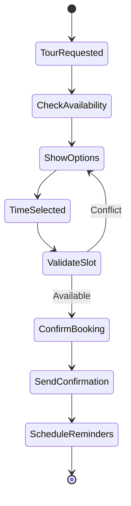

# Skill Specification: AI Leasing Assistant

## Skill ID: SKILL-253
## Gap ID: GAP-AF-001
## Version: 1.0.0
## Status: SPECIFIED ✅
## Created: 2026-01-05
## Domain: communication / leasing

---

## 📋 EXECUTIVE SUMMARY

The **AI Leasing Assistant** is an autonomous, multi-channel conversational AI system that manages the complete leasing funnel from initial prospect inquiry to tour scheduling. It addresses critical industry challenges where 49% of calls go unanswered and 40% of leads receive no response.

### Key Value Propositions
| Metric | Target | Industry Benchmark |
|--------|--------|-------------------|
| Autonomous Handling | 95-97% of inquiries | ~5% escalation rate |
| Response Time | <5 seconds (chat) | Instant 24/7 |
| Lead-to-Tour Conversion | +73% improvement | Industry leading |
| Agent Time Savings | 10+ hours/week | Significant operational savings |

### Target Users
- **Property Management Companies** - Operational efficiency
- **Leasing Agents** - High-value activity focus
- **Prospects/Renters** - Immediate digital experience
- **Property Owners** - Maximized occupancy

---

## 🎯 SKILL DEFINITION

### Core Description
```yaml
name: ai-leasing-assistant
description: |
  Autonomous conversational AI for multifamily leasing that handles prospect 
  inquiries, qualifies leads, schedules tours, and escalates to humans when needed.
  
  Use when: Prospect contacts property via any channel (web chat, SMS, email, voice)
  Do NOT use: For current resident issues, maintenance requests, or payment inquiries

version: 1.0.0
priority: P0
domain: ltr
category: communication
localization: global

triggers:
  keywords: ["available", "apartment", "rent", "lease", "tour", "move-in", "bedroom", "price"]
  intents: ["inquiry", "tour_request", "availability_check", "pricing_question"]
  channels: ["web_chat", "sms", "email", "voice"]

tools:
  - name: conversation_engine
    type: internal
    description: NLP for intent recognition and response generation
    
  - name: lead_qualification
    type: internal
    description: Prospect scoring and qualification workflows
    
  - name: tour_scheduler
    type: mcp
    uri: mcp://calendar/schedule_tour
    
  - name: property_lookup
    type: mcp
    uri: mcp://pms/get_availability
    
  - name: knowledge_retrieval
    type: mcp
    uri: mcp://vector/semantic_search

hitl:
  required: false
  escalate_on: 
    - "fair_housing_question"
    - "price_negotiation"
    - "complaint"
    - "legal_inquiry"
    - "confidence < 0.7"
    - "explicit_agent_request"

evaluation:
  accuracy_target: 0.95
  test_cases_path: tests/leasing/
  metrics:
    - intent_recognition_accuracy
    - response_relevance_score
    - conversation_completion_rate
    - escalation_rate
```

---

## 🏗️ TECHNICAL ARCHITECTURE

### High-Level Components

```
┌─────────────────────────────────────────────────────────────────────────┐
│                        AI LEASING ASSISTANT                             │
├─────────────────────────────────────────────────────────────────────────┤
│                                                                         │
│  ┌─────────────┐   ┌──────────────────┐   ┌─────────────────────────┐  │
│  │ Multi-Channel│   │  Conversation    │   │   Knowledge Bank        │  │
│  │   Gateway    │──▶│     Engine       │◀──│   (Vector DB)           │  │
│  │             │   │                  │   │                         │  │
│  │ • Web Chat  │   │ • Intent Recog.  │   │ • Property Info         │  │
│  │ • SMS       │   │ • Slot Filling   │   │ • Amenities             │  │
│  │ • Email     │   │ • Response Gen.  │   │ • Policies              │  │
│  │ • Voice     │   │ • Context Mgmt   │   │ • FAQs                  │  │
│  └─────────────┘   └──────────────────┘   └─────────────────────────┘  │
│         │                    │                        │                 │
│         ▼                    ▼                        │                 │
│  ┌─────────────┐   ┌──────────────────┐              │                 │
│  │    Lead     │   │  Tour Scheduling │              │                 │
│  │Qualification│   │     System       │◀─────────────┘                 │
│  │   Engine    │   │                  │                                │
│  │             │   │ • In-Person      │                                │
│  │ • Scoring   │   │ • Self-Guided    │                                │
│  │ • Criteria  │   │ • Virtual        │                                │
│  │ • Status    │   │ • Calendar Sync  │                                │
│  └─────────────┘   └──────────────────┘                                │
│         │                    │                                         │
│         ▼                    ▼                                         │
│  ┌───────────────────────────────────────────────────────────────────┐│
│  │                    HUMAN HANDOFF PROTOCOL                         ││
│  │  • Context Transfer • Agent Routing • SLA Compliance              ││
│  └───────────────────────────────────────────────────────────────────┘│
│                                                                        │
├────────────────────────────────────────────────────────────────────────┤
│                        INTEGRATIONS                                    │
│  ┌─────────┐ ┌─────────┐ ┌─────────┐ ┌─────────┐ ┌─────────┐         │
│  │  Yardi  │ │ RealPage│ │AppFolio │ │  CRM    │ │Calendar │         │
│  └─────────┘ └─────────┘ └─────────┘ └─────────┘ └─────────┘         │
└────────────────────────────────────────────────────────────────────────┘
```

### Technology Stack

| Layer | Technology | Purpose |
|-------|-----------|---------|
| **AI/ML** | OpenAI GPT-4 / Claude | Intent recognition, response generation |
| **Backend** | Python 3.12+, FastAPI | Service implementation |
| **Database** | MongoDB 7.0+ | Conversation persistence |
| **Vector DB** | Pinecone | Semantic search, knowledge retrieval |
| **Cache** | Redis Cluster | Session state, context caching |
| **Queue** | Redis Streams | Event processing |
| **Voice** | Twilio Voice | Phone/voice channel |
| **SMS** | Twilio SMS | Text messaging |
| **Email** | SendGrid | Email automation |
| **Frontend** | React 19, TypeScript | Agent dashboard |
| **Container** | Docker, Kubernetes | Deployment |

---

## 📊 FEATURE CATALOG

### F-001: Multi-Channel Conversation Management
| Attribute | Value |
|-----------|-------|
| **Description** | Handle prospect conversations across web chat, SMS, email, and voice with unified context |
| **Priority** | P0 (Must Have) |
| **Complexity** | High |

**Acceptance Criteria:**
- [ ] Support simultaneous conversations across 4 channels
- [ ] Maintain conversation context across channel switches
- [ ] Response time <5 seconds for chat, <30 seconds for SMS
- [ ] Channel-specific formatting (rich cards for web, plain text for SMS)
- [ ] Conversation history accessible across all channels

**Technical Requirements:**
```typescript
interface ConversationMessage {
  message_id: string;
  conversation_id: string;
  channel: 'web_chat' | 'sms' | 'email' | 'voice';
  direction: 'inbound' | 'outbound';
  content: string;
  intent: IntentResult;
  slots: Record<string, any>;
  timestamp: Date;
  metadata: ChannelMetadata;
}
```

---

### F-002: Intent Recognition System
| Attribute | Value |
|-----------|-------|
| **Description** | Classify prospect intents with 95%+ accuracy across 20+ scenarios |
| **Priority** | P0 (Must Have) |
| **Complexity** | High |

**Supported Intents:**
| Intent | Examples | Confidence Target |
|--------|----------|-------------------|
| `availability_inquiry` | "Do you have 2BR available?" | 95% |
| `pricing_inquiry` | "How much is rent?" | 95% |
| `tour_request` | "Can I schedule a tour?" | 95% |
| `amenities_question` | "Do you have a gym?" | 92% |
| `pet_policy` | "Are dogs allowed?" | 92% |
| `move_in_date` | "I need to move next month" | 90% |
| `parking_inquiry` | "Is parking included?" | 90% |
| `utilities_question` | "What utilities are included?" | 90% |
| `application_process` | "How do I apply?" | 92% |
| `lease_terms` | "What's the lease length?" | 90% |

**Intent Recognition Schema:**
```json
{
  "intent": "availability_inquiry",
  "confidence": 0.96,
  "slots": {
    "bedroom_count": 2,
    "move_in_date": "2026-02-15",
    "budget_max": 2500
  },
  "entities": [
    {"type": "BEDROOM", "value": "2BR", "start": 15, "end": 18}
  ]
}
```

---

### F-003: Lead Qualification Engine
| Attribute | Value |
|-----------|-------|
| **Description** | Automatically score and qualify prospects based on configurable criteria |
| **Priority** | P0 (Must Have) |
| **Complexity** | Medium |

**Qualification Criteria:**
| Criterion | Weight | Data Source | Auto-Collect |
|-----------|--------|-------------|--------------|
| Move-in Timeline | 25% | Conversation | Yes |
| Budget Alignment | 25% | Conversation | Yes |
| Credit Indicator | 15% | Self-reported | Optional |
| Income Qualifier | 15% | Self-reported | Optional |
| Pet Status | 10% | Conversation | Yes |
| Lease Length Fit | 10% | Conversation | Yes |

**Lead Scoring Algorithm:**
```python
def calculate_lead_score(prospect: Prospect) -> LeadScore:
    score = 0
    criteria_scores = {}
    
    # Move-in Timeline (25 points max)
    if prospect.move_in_days <= 30:
        criteria_scores['timeline'] = 25
    elif prospect.move_in_days <= 60:
        criteria_scores['timeline'] = 20
    elif prospect.move_in_days <= 90:
        criteria_scores['timeline'] = 15
    else:
        criteria_scores['timeline'] = 5
    
    # Budget Alignment (25 points max)
    if prospect.budget_max >= property.min_rent * 1.2:
        criteria_scores['budget'] = 25
    elif prospect.budget_max >= property.min_rent:
        criteria_scores['budget'] = 20
    else:
        criteria_scores['budget'] = 10
    
    # ... additional criteria
    
    total_score = sum(criteria_scores.values())
    
    return LeadScore(
        total_score=total_score,
        qualification_status='qualified' if total_score >= 70 else 'nurture',
        criteria_scores=criteria_scores
    )
```

**Qualification Statuses:**
| Status | Score Range | Action |
|--------|-------------|--------|
| `hot_lead` | 85-100 | Immediate agent notification |
| `qualified` | 70-84 | Tour scheduling priority |
| `nurture` | 50-69 | Automated follow-up sequence |
| `unqualified` | 0-49 | Archive with reason |

---

### F-004: Tour Scheduling System
| Attribute | Value |
|-----------|-------|
| **Description** | Book in-person, self-guided, and virtual tours with real-time availability |
| **Priority** | P0 (Must Have) |
| **Complexity** | High |

**Tour Types:**
| Type | Description | Requirements |
|------|-------------|--------------|
| **In-Person** | Agent-led property tour | Calendar integration, agent availability |
| **Self-Guided** | Prospect explores independently | Smart lock integration, access code generation |
| **Virtual** | Video call walkthrough | Video conferencing integration |

**Tour Scheduling Flow:**


**Tour Configuration Schema:**
```json
{
  "tour_id": "tour_abc123",
  "prospect_id": "prospect_xyz",
  "property_id": "prop_001",
  "tour_type": "in_person",
  "scheduled_at": "2026-02-15T14:00:00Z",
  "duration_minutes": 30,
  "agent_id": "agent_001",
  "status": "confirmed",
  "reminders": [
    {"type": "email", "hours_before": 24},
    {"type": "sms", "hours_before": 2}
  ],
  "access_details": {
    "access_code": "1234",
    "valid_from": "2026-02-15T13:55:00Z",
    "valid_until": "2026-02-15T14:35:00Z"
  }
}
```

---

### F-005: Knowledge Bank & Retrieval
| Attribute | Value |
|-----------|-------|
| **Description** | Semantic search over property information for accurate responses |
| **Priority** | P0 (Must Have) |
| **Complexity** | Medium |

**Knowledge Categories:**
| Category | Content | Update Frequency |
|----------|---------|------------------|
| Property Details | Address, units, amenities | Real-time from PMS |
| Pricing | Rent, deposits, fees | Real-time from PMS |
| Policies | Pets, parking, lease terms | Daily sync |
| FAQs | Common questions | Manual curation |
| Neighborhood | Schools, transit, dining | Monthly update |

**Retrieval Architecture:**
```python
async def retrieve_knowledge(
    query: str, 
    property_id: str,
    top_k: int = 5
) -> List[KnowledgeItem]:
    # Generate query embedding
    embedding = await embed_text(query)
    
    # Semantic search in vector DB
    results = await vector_db.search(
        embedding=embedding,
        filter={"property_id": property_id},
        top_k=top_k
    )
    
    # Re-rank by relevance
    ranked = rerank_results(query, results)
    
    return ranked
```

---

### F-006: Human Handoff Protocol
| Attribute | Value |
|-----------|-------|
| **Description** | Seamless escalation to human agents with full context transfer |
| **Priority** | P0 (Must Have) |
| **Complexity** | Medium |

**Escalation Triggers:**
| Trigger | Priority | Response |
|---------|----------|----------|
| Fair housing question | Critical | Immediate transfer |
| Price negotiation | High | Agent notification + queue |
| Explicit agent request | High | Immediate transfer |
| Complaint | High | Immediate transfer |
| Low confidence (<70%) | Medium | Soft handoff with context |
| 3+ failed responses | Medium | Offer human transfer |

**Context Transfer Schema:**
```json
{
  "escalation_id": "esc_001",
  "conversation_id": "conv_abc",
  "trigger_reason": "fair_housing_question",
  "priority": "critical",
  "context": {
    "prospect": {
      "name": "John Smith",
      "phone": "+1555123456",
      "email": "john@email.com"
    },
    "conversation_summary": "Prospect asked about 2BR availability...",
    "qualification_status": "qualified",
    "lead_score": 82,
    "key_interests": ["2BR", "pet-friendly", "Feb move-in"],
    "messages_history": [...]
  },
  "recommended_response": "This prospect is highly qualified..."
}
```

---

## 📐 DATA MODEL

### Core Entities

```sql
-- Properties
CREATE TABLE properties (
    property_id UUID PRIMARY KEY,
    name VARCHAR(255) NOT NULL,
    address JSONB NOT NULL,
    amenities TEXT[],
    policies JSONB,
    created_at TIMESTAMP DEFAULT NOW(),
    updated_at TIMESTAMP DEFAULT NOW()
);

-- Prospects
CREATE TABLE prospects (
    prospect_id UUID PRIMARY KEY,
    property_id UUID REFERENCES properties(property_id),
    first_name VARCHAR(100),
    last_name VARCHAR(100),
    email VARCHAR(255),
    phone VARCHAR(20),
    preferences JSONB,
    source VARCHAR(50),
    status VARCHAR(50) DEFAULT 'active',
    created_at TIMESTAMP DEFAULT NOW(),
    updated_at TIMESTAMP DEFAULT NOW()
);

-- Conversations
CREATE TABLE conversations (
    conversation_id UUID PRIMARY KEY,
    prospect_id UUID REFERENCES prospects(prospect_id),
    property_id UUID REFERENCES properties(property_id),
    channel VARCHAR(50) NOT NULL,
    status VARCHAR(50) DEFAULT 'active',
    context JSONB,
    started_at TIMESTAMP DEFAULT NOW(),
    last_message_at TIMESTAMP,
    ended_at TIMESTAMP
);

-- Messages
CREATE TABLE messages (
    message_id UUID PRIMARY KEY,
    conversation_id UUID REFERENCES conversations(conversation_id),
    direction VARCHAR(20) NOT NULL,
    content TEXT NOT NULL,
    intent VARCHAR(100),
    intent_confidence DECIMAL(5,4),
    slots JSONB,
    channel VARCHAR(50),
    sent_at TIMESTAMP DEFAULT NOW(),
    delivered_at TIMESTAMP,
    read_at TIMESTAMP
);

-- Lead Scores
CREATE TABLE lead_scores (
    score_id UUID PRIMARY KEY,
    prospect_id UUID REFERENCES prospects(prospect_id),
    total_score INTEGER NOT NULL,
    criteria_scores JSONB NOT NULL,
    qualification_status VARCHAR(50) NOT NULL,
    calculated_at TIMESTAMP DEFAULT NOW(),
    expires_at TIMESTAMP
);

-- Tours
CREATE TABLE tours (
    tour_id UUID PRIMARY KEY,
    prospect_id UUID REFERENCES prospects(prospect_id),
    property_id UUID REFERENCES properties(property_id),
    agent_id UUID,
    tour_type VARCHAR(50) NOT NULL,
    scheduled_at TIMESTAMP NOT NULL,
    duration_minutes INTEGER DEFAULT 30,
    status VARCHAR(50) DEFAULT 'scheduled',
    access_details JSONB,
    notes TEXT,
    created_at TIMESTAMP DEFAULT NOW(),
    updated_at TIMESTAMP DEFAULT NOW()
);

-- Escalations
CREATE TABLE escalations (
    escalation_id UUID PRIMARY KEY,
    conversation_id UUID REFERENCES conversations(conversation_id),
    agent_id UUID,
    trigger_reason VARCHAR(100) NOT NULL,
    priority VARCHAR(20) NOT NULL,
    context_data JSONB,
    status VARCHAR(50) DEFAULT 'pending',
    created_at TIMESTAMP DEFAULT NOW(),
    resolved_at TIMESTAMP
);

-- Indexes
CREATE INDEX idx_conversations_prospect ON conversations(prospect_id);
CREATE INDEX idx_conversations_property ON conversations(property_id);
CREATE INDEX idx_messages_conversation ON messages(conversation_id);
CREATE INDEX idx_tours_scheduled ON tours(scheduled_at);
CREATE INDEX idx_lead_scores_prospect ON lead_scores(prospect_id);
```

---

## 🔌 API SPECIFICATION

### Conversation API

```yaml
openapi: 3.0.0
paths:
  /api/v1/conversations:
    post:
      summary: Create new conversation
      requestBody:
        content:
          application/json:
            schema:
              type: object
              properties:
                prospect_id: string
                property_id: string
                channel: string
                initial_message: string
      responses:
        '201':
          description: Conversation created
          
  /api/v1/conversations/{conversation_id}/messages:
    post:
      summary: Send message in conversation
      parameters:
        - name: conversation_id
          in: path
          required: true
      requestBody:
        content:
          application/json:
            schema:
              type: object
              properties:
                content: string
                channel: string
      responses:
        '200':
          description: AI response generated
          content:
            application/json:
              schema:
                type: object
                properties:
                  message_id: string
                  response: string
                  intent: object
                  suggested_actions: array

  /api/v1/tours:
    post:
      summary: Schedule a tour
      requestBody:
        content:
          application/json:
            schema:
              type: object
              properties:
                prospect_id: string
                property_id: string
                tour_type: string
                preferred_times: array
      responses:
        '201':
          description: Tour scheduled
          
  /api/v1/leads/{prospect_id}/score:
    get:
      summary: Get lead qualification score
      responses:
        '200':
          description: Lead score retrieved
```

---

## ⚡ PERFORMANCE REQUIREMENTS

| Metric | Target | Maximum |
|--------|--------|---------|
| Chat Response Time | <2 seconds P50 | <5 seconds P99 |
| SMS Response Time | <10 seconds | <30 seconds |
| Voice Response Time | <500ms | <1 second |
| Intent Recognition | <200ms | <500ms |
| Knowledge Retrieval | <300ms | <1 second |
| Tour Booking | <2 seconds | <5 seconds |
| System Availability | 99.9% | - |
| Concurrent Conversations | 10,000 | 50,000 |

---

## 🔒 SECURITY & COMPLIANCE

### Fair Housing Compliance
- All responses validated against fair housing guidelines
- Protected class mentions flagged for review
- Accommodation requests trigger human handoff
- Audit trail for all conversations

### Data Privacy
- PII encrypted at rest (AES-256)
- PII encrypted in transit (TLS 1.3)
- Conversation retention: 2 years
- Right to deletion supported
- CCPA/GDPR compliant

### Access Control
- Role-based access (Agent, Manager, Admin)
- Property-level isolation
- Audit logging for all actions

---

## 📈 SUCCESS METRICS

| KPI | Target | Measurement |
|-----|--------|-------------|
| Autonomous Resolution Rate | 95% | Conversations without escalation |
| Lead-to-Tour Conversion | +73% | Tours scheduled / qualified leads |
| Response Time (Chat) | <5s | P95 latency |
| Intent Accuracy | 95% | Correct classification rate |
| Prospect Satisfaction | 4.5/5 | Post-conversation survey |
| Agent Productivity | +10 hrs/week | Time saved per agent |
| Tour No-Show Rate | <15% | No-shows / scheduled tours |

---

## 🔗 INTEGRATION POINTS

| System | Direction | Protocol | Data |
|--------|-----------|----------|------|
| Yardi Voyager | Bidirectional | REST API | Inventory, pricing, availability |
| RealPage | Bidirectional | REST API | Inventory, pricing, availability |
| AppFolio | Bidirectional | REST API | Inventory, pricing, leads |
| Salesforce | Push | REST API | Lead creation, updates |
| HubSpot | Push | REST API | Lead management |
| Google Calendar | Bidirectional | CalDAV | Agent availability, bookings |
| Outlook Calendar | Bidirectional | Microsoft Graph | Agent availability, bookings |
| Twilio | Event-driven | Webhooks | SMS, Voice |
| SendGrid | Push | REST API | Email delivery |
| RemoteLock | Push | REST API | Access code generation |

---

## 🚀 IMPLEMENTATION PHASES

### Phase 1: Core Functionality (Weeks 1-6)
- [ ] Conversation Engine with intent recognition
- [ ] Multi-channel gateway (web chat, SMS)
- [ ] Basic lead qualification
- [ ] Knowledge bank with property data
- [ ] Database schema implementation

### Phase 2: Tour Scheduling (Weeks 7-10)
- [ ] In-person tour booking
- [ ] Calendar integration
- [ ] Self-guided tour with smart lock
- [ ] Reminder automation
- [ ] Agent notification system

### Phase 3: Advanced Features (Weeks 11-14)
- [ ] Voice channel integration
- [ ] Advanced lead scoring
- [ ] Human handoff protocol
- [ ] Analytics dashboard
- [ ] Performance monitoring

### Phase 4: Optimization (Weeks 15-18)
- [ ] A/B testing framework
- [ ] Model fine-tuning
- [ ] Advanced reporting
- [ ] Multi-property support
- [ ] White-label capabilities

---

## 📚 REFERENCES

### Source Documents
- `knowledge/communication/KD-AF-001-ai-leasing-assistant.md` - Research foundation
- `knowledge/communication/ES-AF-001-ai-leasing-assistant.md` - Engineering specification (10,773 lines)
- `docs/prompts/ENGINEERING_SPEC_PROMPT_AI_LEASING.md` - Engineering prompt

### Competitor Analysis
- **EliseAI**: LeasingAI with 95% autonomous handling
- **AppFolio**: Lisa AI and Realm-X Leasing Performer
- **Funnel Leasing**: Virtual Assistant with 72% after-hours tours
- **MRI Software**: Industry best practices

### Research Sources (from Stage 1)
- EliseAI Platform Overview
- AppFolio Realm-X Documentation
- Funnel Leasing Virtual Assistant
- Multifamily Insiders Forum

---

## ✅ SPECIFICATION COMPLETE

| Stage | Status | Date | Agent |
|-------|--------|------|-------|
| Stage 1: Research | ✅ Complete | 2026-01-05 | Research Agent |
| Stage 2: Engineering Prompt | ✅ Complete | 2026-01-05 | Cursor AI |
| Stage 3: Engineering Spec | ✅ Complete | 2026-01-05 | Engineering Agent |
| Stage 4: Skill Specification | ✅ **Complete** | 2026-01-05 | Cursor AI |

**Total Lines in Engineering Spec**: 10,773
**Quality Assessment**: 9.0/10 (Exceptional)
**Skills Specified**: 1 (SKILL-253)
**Related Features**: 6 core features documented

---

*This specification serves as the definitive blueprint for implementing the AI Leasing Assistant skill in the CitadelOS platform.*

